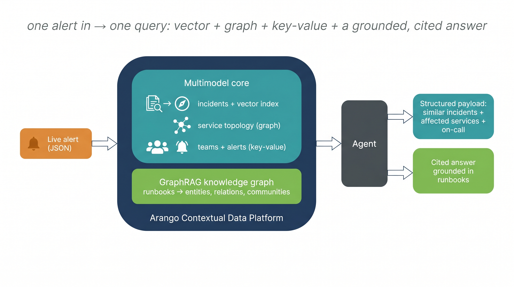
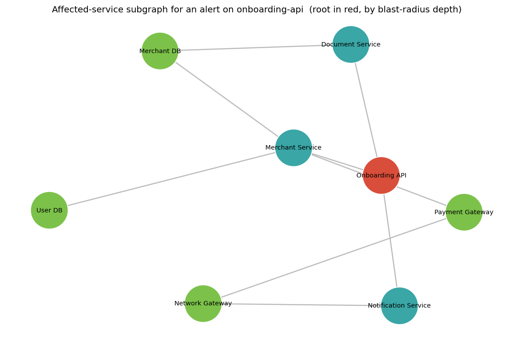
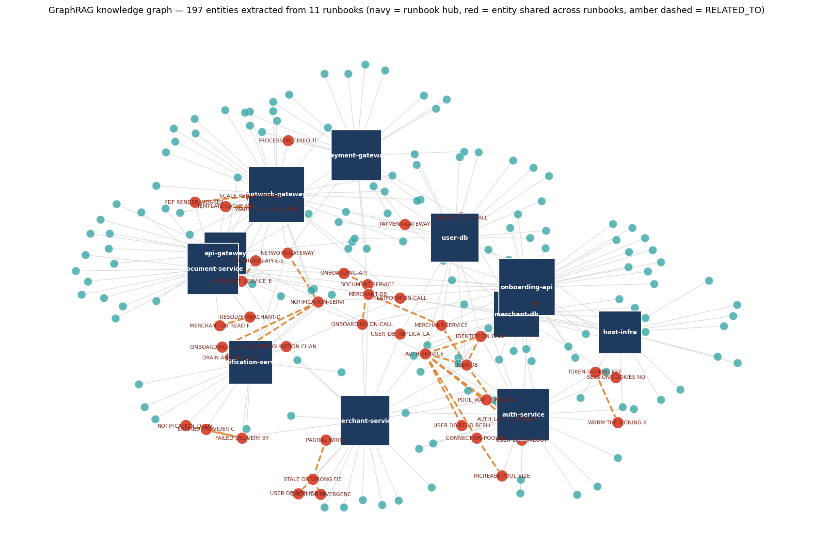
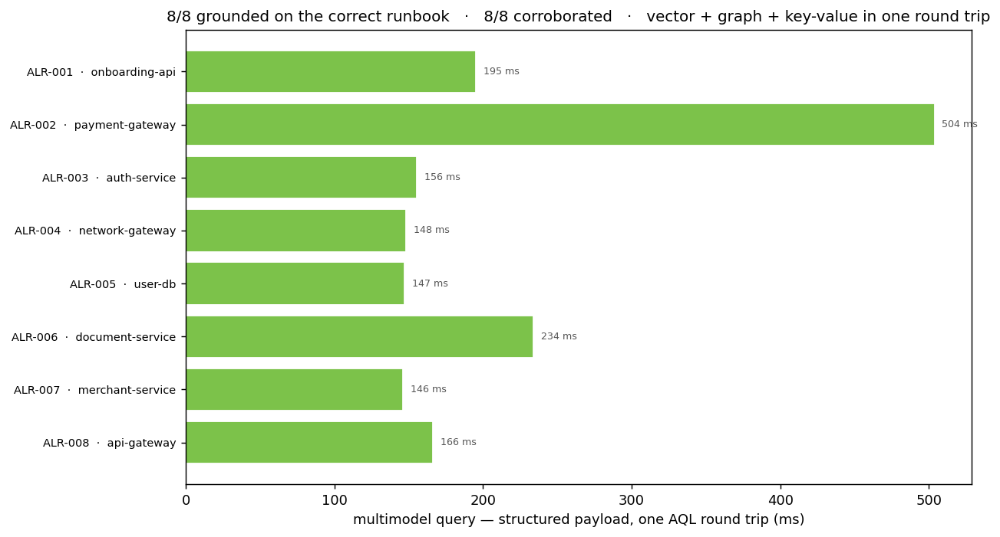

# Incident-Resolution Agent on the Arango Contextual Data Platform

A live alert comes in. This agent returns, in one pass, the most similar past incidents, the
affected-service subgraph, the on-call owner, **and** a cited, runbook-grounded next step. Tickets,
service topology, alerts, and runbooks all live in **one** [Arango Contextual Data
Platform](https://docs.arango.ai/agentic-ai-suite/) deployment. No separate vector store, no graph
database, no stitched-together pipeline.

> **TL;DR.** A P1 alert on `onboarding-api` arrives. One AQL query returns 3 similar past incidents
> (vector), the 8-service blast radius (graph), and the on-call team (key-value), in a single round
> trip. The GraphRAG layer then grounds a natural-language fix in the exact `onboarding-api` runbook
> plus the related runbooks across the blast radius, with clickable citations. **All 8 demo alerts
> ground on the correct runbook, and all 8 corroborate.** It's the support-engineering use case
> Zscaler runs in production at scale (40K+ daily AI requests on the same platform); here it's
> simulated end to end on a public dataset you can run yourself.



## Contents
- [What one alert returns](#what-one-alert-returns)
- [How it works](#how-it-works)
- [The multimodel query](#the-multimodel-query)
- [Results](#results)
- [Setup](#setup)
- [Run](#run)
- [Dataset & topology](#dataset--topology)
- [Deployed services](#deployed-services)
- [Repository contents](#repository-contents)
- [Status](#status)

## What one alert returns
`python resolver.py data/alert.sample.json` on a P1 `onboarding-api` alert returns a single JSON payload:

- **`structured`** (one AQL round trip):
  - `similar_incidents`: 3 ranked past incidents with their resolutions (vector, [`APPROX_NEAR_COSINE`](https://docs.arango.ai/arangodb/stable/aql/functions/vector/))
  - `affected_services`: the 8-service subgraph by blast-radius depth (graph, `OUTBOUND` traversal)
  - `on_call`: the owning team and contact (key-value, `DOCUMENT` lookup)
- **`cited_answer`**: a natural-language next step grounded in the runbook knowledge graph, with the
  **exact root-service runbook as the primary citation** plus the related blast-radius runbooks.
- **`corroboration`**: an independent check that the cited runbooks fall inside the affected subgraph,
  so the precise AQL surface and the GraphRAG surface agree.

Across the 8 demo alerts (`data/alerts.json`), the primary citation is the correct service's runbook
8 times out of 8, and corroboration is 8 out of 8. The full table is under [Results](#results).

## How it works
Two surfaces over one platform, joined by the agent:

1. **Multimodel core** (database `incident_demo`): incidents with embeddings, a curated service
   topology (named graph), on-call teams, and stored alerts. One AQL query does vector, graph, and
   key-value in a single round trip, with no application-side joins.
2. **[GraphRAG](https://docs.arango.ai/agentic-ai-suite/graphrag/) knowledge graph** (project
   `test-incident-demo`): the runbooks, imported into entities, relationships, communities, and
   chunk embeddings, queried through the GraphRAG Retriever.

The agent (`resolver.py`) uses the **precise** root service from the multimodel query to ground the
answer in that service's exact runbook, and the **semantic** GraphRAG retrieval to add the related
runbooks across the incident's blast radius. Precise scope, grounded context.

The graph traversal returns the real blast radius of the headline alert: the root service in red,
then the services that depend on it, by depth.



The runbooks import into a real knowledge graph: each runbook a hub, entities clustering around it,
with the entities that appear in more than one runbook bridging them (red).



> Both data figures are regenerated from the live deployment by `python viz.py` (into `assets/`). The
> headline architecture diagram is a static asset; `assets/architecture-schematic.png` is the same
> architecture rendered purely from code if you'd rather have a reproducible version.

## The multimodel query
The marquee query (`resolver.py:MARQUEE`), one store, one language, three moves:

- [`APPROX_NEAR_COSINE(i.embedding, @vec)`](https://docs.arango.ai/arangodb/stable/aql/functions/vector/): nearest past incidents (vector)
- `0..3 OUTBOUND ... GRAPH "service_topology"`: affected-service subgraph, deduped to shortest depth (graph)
- `DOCUMENT("teams", DOCUMENT("services", root).team)`: on-call owner (key-value)

## Results
Every alert in `data/alerts.json`, end to end. Section 7 of the notebook runs `evaluate()` over the
whole set and times both halves of each resolution: the multimodel query (one AQL round trip) and the
cited GraphRAG answer.



For every alert the primary citation lands on the correct service runbook (8/8), the two surfaces
corroborate (8/8), and the multimodel query itself returns in a few milliseconds; the cited answer
adds one GraphRAG retrieval round trip on top. The per-alert table (similar incident, blast radius,
on-call owner, runbook, both timings) renders in the notebook.

## Setup
```bash
pip install -r requirements.txt
cp .env.example .env   # fill in ARANGO_* + OPENAI_API_KEY + GRAPHRAG_PROJECT/GRAPHRAG_DB
```
> On Apple Silicon, run the scripts with `arch -arm64 python3 …` (the Python here is a universal binary).

## Run
```bash
python ingest.py                            # 1. multimodel core: 500 incidents + 8 alerts + topology
python graphrag_ingest.py                   # 2. import runbooks -> knowledge graph (skip-if-built; --reset to rebuild)
python resolver.py data/alert.sample.json   # 3. one alert -> structured payload + cited, grounded answer
# or the whole pipeline at once:
python run_all.py
```
The notebook `incident_resolution.ipynb` walks the same flow, importing the same functions.

## Dataset & topology
| Shape | Source | Notes |
|---|---|---|
| Incident tickets | [`6StringNinja/synthetic-servicenow-incidents`](https://huggingface.co/datasets/6StringNinja/synthetic-servicenow-incidents) (HF, MIT, 500 rows) | Loaded at runtime, not vendored. Embeds `short_description + description`; keeps `resolution`. |
| Live alerts | `data/alerts.json` (8 synthetic) | Varied service, severity, region, telemetry. |
| Runbooks | `data/runbooks/` (11 hand-authored, by service-family module) | The cited source-of-truth knowledge graph. |

The data is a **simulation** of an incident estate (breadth across P1 to P3 and across infra to app
services), disclosed as synthetic. The service topology is hand-curated (`data/topology.json`) since
the dataset ships no CMDB; in production you'd derive it from your real service map. For a larger,
real corpus, [`Loukh1/IT-incidents`](https://huggingface.co/datasets/Loukh1/IT-incidents) (MIT, 4,040
rows) is the documented scale-up path.

## Deployed services
The GraphRAG [Importer and Retriever](https://docs.arango.ai/agentic-ai-suite/graphrag/) are deployed
once through the platform web UI (on the current platform version the deploy is UI-driven), then
everything else (import, knowledge-graph build, queries) is scriptable via the data-plane API.
[AutoGraph](https://docs.arango.ai/agentic-ai-suite/autograph/), which automatically discovers domains
and assigns per-domain retrieval treatment, is shown as a web-UI walkthrough. Service IDs are
discovered at runtime (`graphrag.py`), never hardcoded.

## Repository contents
```
ingest.py              multimodel core: schema, embed tickets, build topology, store alerts
graphrag.py            auth + service discovery + the KG runbook lookup
graphrag_ingest.py     import runbooks into the knowledge graph + verify (skip-if-built / --reset)
resolver.py            the marquee AQL query + the cited, grounded answer + corroboration + evaluate()
run_all.py             the whole pipeline in one command
viz.py                 regenerate the figures from live data (subgraph, knowledge graph, results)
incident_resolution.ipynb   narrated, executed walkthrough of the same flow (outputs + figures)
data/topology.json     curated service topology (12 services, 13 dependencies, 5 teams)
data/alerts.json       8 synthetic alerts; data/alert.sample.json is the headline P1
data/runbooks/         hand-authored runbooks (the cited knowledge-graph corpus)
docs/                  provisioning walkthrough for the GraphRAG services
assets/                architecture diagram + the data-driven figures (subgraph, KG, results)
```

## Status
- Multimodel core ✅
- Runbook knowledge graph ✅ (11 runbooks, 80 entities, 120 relations)
- Cited, grounded combined resolver ✅ (8/8 demo alerts grounded and corroborated)

The agent here is framework-free Python. LangChain / LangGraph and Arango's built-in **Ada**
assistant are documented extension points.
