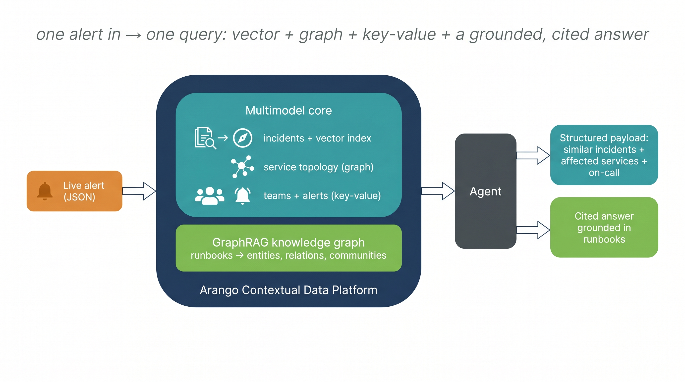
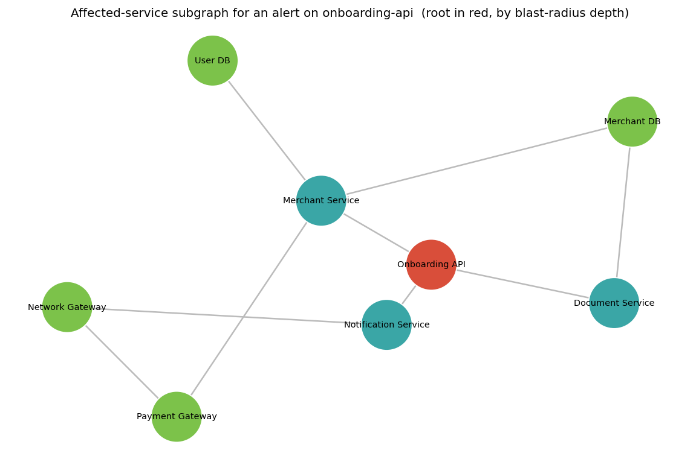
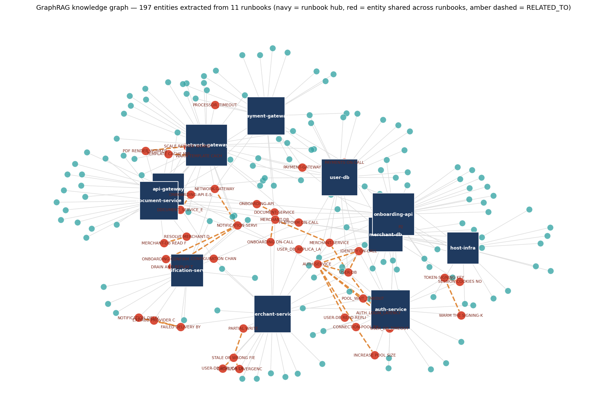
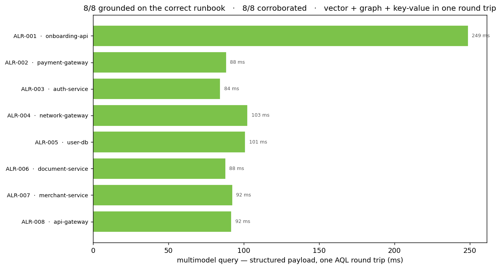

# Incident-Resolution Agent on Arango

A support-engineering agent built on the [Arango Contextual Data Platform](https://docs.arango.ai/agentic-ai-suite/). When a live alert
comes in, it returns in one pass the most similar past incidents, the affected-service blast
radius, the on-call owner, **and** a cited, runbook-grounded next step. Tickets, service
topology, alerts, and runbooks all live in **one** deployment: no separate vector store, no
graph database, no stitched-together pipeline.

The hero case the tutorial follows is a **P1 alert on `onboarding-api`**: one AQL query returns
3 similar past incidents (vector), the service blast radius (graph), and the on-call team
(key-value) in a single round trip, and the AutoGraph knowledge graph then grounds a
natural-language fix in the exact `onboarding-api` runbook plus the related runbooks across the
blast radius, with inline citations. Across all 8 demo alerts, the primary citation lands on the
correct runbook and both retrieval surfaces corroborate, 8 times out of 8. It is the
support-engineering use case Zscaler runs in production at scale (40K+ daily AI requests on the
same platform); here it is simulated end to end on a public dataset you can run yourself.

## Contents
- [How it works](#how-it-works)
- [The hero alert](#the-hero-alert)
- [The marquee query](#the-marquee-query)
- [Results](#results)
- [Repository layout](#repository-layout)
- [The dataset](#the-dataset)
- [Prerequisites](#prerequisites)
- [Setup](#setup)
- [Running the pipeline](#running-the-pipeline)
- [Models](#models)
- [Status](#status)
- [Attribution](#attribution)

## How it works

Two surfaces over one platform, joined by the agent.



| Layer | Built by | What it contributes |
|-------|----------|---------------------|
| Multimodel core | `src/ingest.py` | Incidents with embeddings, a curated service topology (named graph), on-call teams, and stored alerts, all in database `incident_demo` |
| Vector recall | `src/ingest.py` | Past incidents embedded for similarity search via `APPROX_NEAR_COSINE` |
| Service graph | `src/ingest.py` | The `service_topology` named graph: who depends on whom, traversed for the blast radius |
| Knowledge graph | AutoGraph (web UI) + the Retriever | The cited reason a fix applies, built from the runbook corpus |

A single AQL query (the "marquee") resolves the vector recall of similar incidents, the
affected-service subgraph, and the on-call owner in one round trip, with no application-side
joins. The agent (`src/resolver.py`) then uses the **precise** root service from that query to
ground the answer in that service's exact runbook, and a **semantic** Retriever pass (Unified
Search) to add the related runbooks across the incident's blast radius. Precise scope, grounded
context.

## The hero alert

`python src/resolver.py data/alert.sample.json` on a P1 `onboarding-api` alert returns a single
JSON payload:

- **`structured`** (one AQL round trip):
  - `similar_incidents`: 3 ranked past incidents with their resolutions (vector, [`APPROX_NEAR_COSINE`](https://docs.arango.ai/arangodb/stable/aql/functions/vector/))
  - `affected_services`: the affected-service subgraph by blast-radius depth (graph, `OUTBOUND` traversal)
  - `on_call`: the owning team and contact (key-value, `DOCUMENT` lookup)
- **`cited_answer`**: a natural-language next step grounded in the runbook knowledge graph,
  with the **exact root-service runbook as the primary citation** plus the related blast-radius
  runbooks.
- **`corroboration`**: an independent check that the cited runbooks fall inside the affected
  subgraph, so the precise AQL surface and the semantic retrieval surface agree.

The graph traversal returns the real blast radius of the headline alert: the root service in
red, then the services that depend on it, by depth.



The runbooks import into a real knowledge graph: each runbook a hub, entities clustering around
it, with the entities that appear in more than one runbook bridging them (red).



> Both data figures are regenerated from the live deployment by `python src/viz.py` (into
> `assets/`). The headline architecture diagram is a static asset;
> `assets/architecture-schematic.png` is the same architecture rendered purely from code if you
> would rather have a reproducible version.

## The marquee query

One store, one language, three moves (`src/resolver.py:MARQUEE`):

- [`APPROX_NEAR_COSINE(i.embedding, @vec)`](https://docs.arango.ai/arangodb/stable/aql/functions/vector/): nearest past incidents (vector)
- `0..3 OUTBOUND ... GRAPH "service_topology"`: affected-service subgraph, deduped to shortest depth (graph)
- `DOCUMENT("teams", DOCUMENT("services", root).team)`: on-call owner (key-value)

## Results

Every alert in `data/alerts.json`, end to end. Section 7 of the notebook runs `evaluate()` over
the whole set and times both halves of each resolution: the multimodel query (one AQL round
trip) and the cited answer from the Retriever.



For every alert the primary citation lands on the correct service runbook (8/8), the two
surfaces corroborate (8/8), and the multimodel query itself returns in a few milliseconds; the
cited answer adds one Retriever round trip on top. The per-alert table (similar incident, blast
radius, on-call owner, runbook, both timings) renders in the notebook.

## Repository layout

```
.
├── incident_resolution.ipynb        # narrated, executed walkthrough of the full flow
├── requirements.txt
├── .env.example
│
├── src/
│   ├── ingest.py                    # multimodel core: schema, embed tickets, build topology, store alerts
│   ├── graphrag.py                  # auth + service discovery + the KG runbook lookup
│   ├── graphrag_ingest.py           # build the runbook KG with AutoGraph (import -> corpus build -> strategizer -> orchestrate) + verify
│   ├── resolver.py                  # the marquee AQL query + cited grounded answer + corroboration + evaluate()
│   ├── run_all.py                   # the whole pipeline in one command
│   └── viz.py                       # regenerate the figures from live data (subgraph, KG, results)
│
├── data/
│   ├── topology.json                # curated service topology (12 services, 13 dependencies, 5 teams)
│   ├── alerts.json                  # 8 synthetic alerts; alert.sample.json is the headline P1
│   └── runbooks/                    # 11 hand-authored runbooks (the cited knowledge-graph corpus)
│
├── docs/                            # provisioning walkthrough for the AutoGraph services
└── assets/                          # architecture diagram + the data-driven figures
```

## The dataset

| Shape | Source | Notes |
|---|---|---|
| Incident tickets | [`6StringNinja/synthetic-servicenow-incidents`](https://huggingface.co/datasets/6StringNinja/synthetic-servicenow-incidents) (HF, MIT, 500 rows) | Loaded at runtime, not vendored. Embeds `short_description + description`; keeps `resolution`. |
| Live alerts | `data/alerts.json` (8 synthetic) | Varied service, severity, region, telemetry. |
| Runbooks | `data/runbooks/` (11 hand-authored, by service-family module) | The cited source-of-truth knowledge graph. |

The data is a **simulation** of an incident estate (breadth across P1 to P3 and across infra to
app services), disclosed as synthetic. The service topology is hand-curated
(`data/topology.json`) since the dataset ships no CMDB; in production you would derive it from
your real service map. For a larger, real corpus,
[`Loukh1/IT-incidents`](https://huggingface.co/datasets/Loukh1/IT-incidents) (MIT, 4,040 rows)
is the documented scale-up path.

## Prerequisites

- An **Arango Managed Platform** deployment with the **Contextual Data Platform** profile
  enabled (this unlocks AutoGraph and the Retriever).
- **Python 3.12**
- An **OpenAI API key**

## Setup

Clone the repo and install dependencies:

```bash
pip install -r requirements.txt
```

Copy `.env.example` to `.env` and fill in your credentials:

```
ARANGO_HOST=https://<your-deployment>.arango.ai
ARANGO_DB=incident_demo
ARANGO_USER=<user>
ARANGO_PASSWORD=<password>
OPENAI_API_KEY=<your-key>
GRAPHRAG_DB=incident_demo
GRAPHRAG_PROJECT=incidents-runbook-autograph
```

`GRAPHRAG_DB` and `GRAPHRAG_PROJECT` point at the AutoGraph project whose knowledge-graph
collections live in the same database as the multimodel core. The Retriever and AutoGraph
service postfixes are discovered at runtime (`src/graphrag.py`), so no service IDs are
hardcoded.

> On Apple Silicon, run the scripts with `arch -arm64 python3 ...` (the Python here is a universal
> binary).

## Running the pipeline

The notebook `incident_resolution.ipynb` runs the whole thing, importing the same functions from
`src/` so nothing is duplicated. Or run the scripts directly:

```bash
python src/ingest.py                            # 1. multimodel core: 500 incidents + 8 alerts + topology
python src/graphrag_ingest.py                   # 2. build the runbook KG with AutoGraph (skip-if-built; --reset to rebuild)
python src/resolver.py data/alert.sample.json   # 3. one alert -> structured payload + cited, grounded answer
python src/run_all.py                           # or the whole pipeline at once
```

The [AutoGraph](https://docs.arango.ai/agentic-ai-suite/autograph/) service is deployed by
creating the AutoGraph project through the platform web UI wizard (Documents, Configure, Build):
you upload the runbooks as a category, choose the chat and embedding models, and start the build,
which deploys the service and builds the Corpus Graph. From the project overview you then generate
strategies, review the per-cluster strategy and ontology, and click **Continue to build** to build
the Knowledge Graph. The import and corpus steps are also scriptable over the documented
[AutoGraph REST API](https://docs.arango.ai/agentic-ai-suite/autograph/reference/) via
`graphrag_ingest.py` (`import-multiple`, `corpus/builds`, `rag-strategizer`), where AutoGraph
discovers the domains and assigns per-domain retrieval treatment automatically. Service postfixes
are discovered at runtime (`src/graphrag.py`), never hardcoded. The cited answer uses the
Retriever's Unified Search.

## Models

The pipeline uses `text-embedding-3-small` (1,536 dimensions) for all embeddings, on both the
ingest and query sides, so the vector spaces match. The agent's reasoning uses `gpt-5-mini`
(set in `src/resolver.py`).

## Status

- Multimodel core ✅
- AutoGraph runbook knowledge graph ✅: import, corpus build, and strategizer run via the
  AutoGraph REST API; the Knowledge Graph is built from the project overview in the UI.
- Cited, grounded combined resolver ✅: Unified Search + content grounding; all 8 demo alerts
  grounded on the correct runbook and corroborated.

## Attribution

Built on the [Arango Contextual Data Platform](https://arango.ai/). Incident tickets from
[`6StringNinja/synthetic-servicenow-incidents`](https://huggingface.co/datasets/6StringNinja/synthetic-servicenow-incidents)
(MIT). Alerts, runbooks, and service topology are synthesized for this tutorial. The agent here
is framework-free Python; LangChain / LangGraph and Arango's built-in **Ada** assistant are
documented extension points.